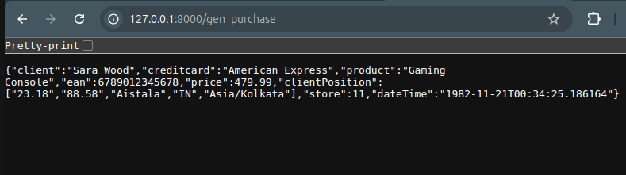

# 🛒 FastAPI Online Store

This is a FastAPI-based project for an online store that serves a dynamically rendered simple homepage HTML using **Jinja2** and static assets like images.

This project uses **Faker** to generate purchases from a CSV list of products and **Pandas** to read that list and make it available to the application. The data is not stored in a database but is instead loaded directly from a CSV file.

## Features
- FastAPI backend with **asynchronous support**
- Serves HTML templates using **Jinja2**
- Handles **static files** (CSS, JS, Images)
- Implements **Poetry** for dependency management
- Reads and processes **CSV product lists** using **Pandas**
- Generates fake purchase data using **Faker**
- Well-structured project architecture
- Built-in **Swagger UI** and **ReDoc** for API documentation
- Scalable and easy to extend

## 📂 Project Structure
- `src/` - Main application directory
  - `data/` - Stores product CSV files and other data assets
  - `templates/` - HTML templates
    - `index.html` - Homepage template
    - `layout.html` - Base layout template
  - `static/` - Static files (CSS, JS, images)
    - `images/` - Stores images used in the application
- `pyproject.toml` - Poetry configuration file
- `poetry.lock` - Dependency lock file managed by Poetry

## Installation
### Clone the repository

git clone https://github.com/ItaSsa/fast_api_faker.git
cd my_project

### Install dependencies
```sh
poetry install
```

### Run the FastAPI server
```sh
poetry run uvicorn src.main:app --reload
```
## Usage

After running the server, access the following URLs:
- **API Root**: [http://127.0.0.1:8000](http://127.0.0.1:8000)
- **API Docs (Swagger UI)**: [http://127.0.0.1:8000/docs](http://127.0.0.1:8000/docs)
- **Alternative API Docs (ReDoc)**: [http://127.0.0.1:8000/redoc](http://127.0.0.1:8000/redoc)
- **Static Files**: [http://127.0.0.1:8000/static/images/logo.png](http://127.0.0.1:8000/static/images/logo.png)


## API Endpoints

| Method  | Endpoint                        | Description                      |
|---------|---------------------------------|----------------------------------|
| `GET`   | `/`                             | Homepage                         |
| `GET`   | `/gen_purchase`                 | Generate a single purchase       |
| `GET`   | `/gen_purchase/{record_number}` | Generate multiple purchases      |
| `GET`   | `/docs`                         | Swagger UI Docs                  |
| `GET`   | `/redoc`                        | ReDoc API Docs                   |
| `GET`   | `/static/images/logo.png`       | Access static files              |

## CSV-Based Data Handling

This project does **not** use a database. Instead, it reads product data from a CSV file stored in the `data/` directory. The CSV file should contain product information such as product name, EAN, and price. The data is loaded into **Pandas** and used dynamically for generating fake purchases with **Faker**.

Example CSV file (`data/products.csv`):

Product Name,EAN,Price
Laptop,1234567890123,1200.99
Smartphone,2345678901234,799.49
Headphones,3456789012345,199.99

## Outcomes

### Home page


### Generated purchases

